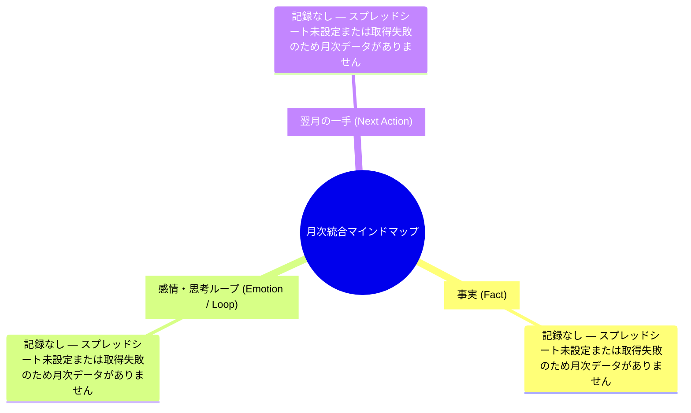

# 月次統合マインドマップ 2026-09

> 生成: 2026-09-04 23:33 JST  
> 入力: 2026-09分の #インプット / #ヘルス・日報 ログ 0件(スプレッドシート集約)

## Mermaidマインドマップ

## Markdownツリー

- 月次統合マインドマップ
  - 事実 (Fact)
    - 記録なし — スプレッドシート未設定または取得失敗のため月次データがありません
  - 感情・思考ループ (Emotion / Loop)
    - 記録なし — スプレッドシート未設定または取得失敗のため月次データがありません
  - 翌月の一手 (Next Action)
    - 記録なし — スプレッドシート未設定または取得失敗のため月次データがありません

## 検出された思考のループ

思考のループは検出されませんでした(データなしのため判定不能)。

## 翌月の一手(最重要1項目)

**判定不能** — 十分なログが無いため提示できません。
