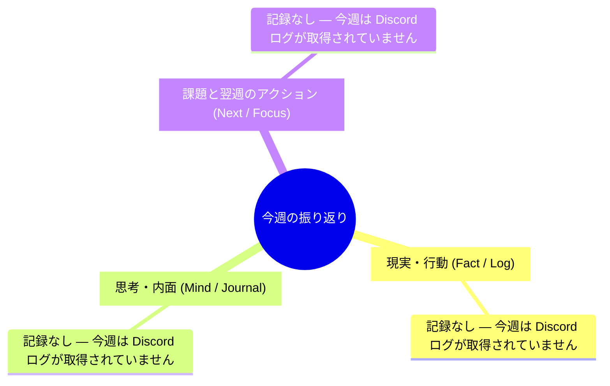

# 週次マインドマップ 2026-W36

> 生成: 2026-09-04 13:07 JST  
> 入力: 直近7日分の #インプット / #ヘルス・日報 ログ 0件  
> ブランチ: 1.現実・行動(Fact/Log) / 2.思考・内面(Mind/Journal) / 3.課題と翌週のアクション(Next/Focus)

## Mermaidマインドマップ

## Markdownツリー

- 今週の振り返り
  - 現実・行動 (Fact / Log)
    - 記録なし — 今週は Discord ログが取得されていません
  - 思考・内面 (Mind / Journal)
    - 記録なし — 今週は Discord ログが取得されていません
  - 課題と翌週のアクション (Next / Focus)
    - 記録なし — 今週は Discord ログが取得されていません

